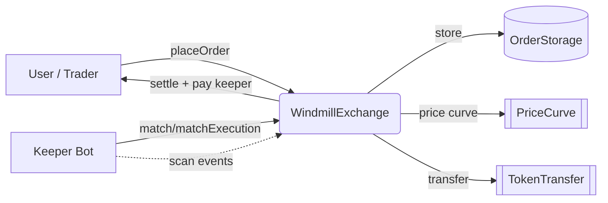

<!-- Don't delete it -->
<div name="readme-top"></div>

<!-- Organization Logo -->
<div align="center" style="display: flex; align-items: center; justify-content: center; gap: 16px;">
  
  
</div>

&nbsp;

<div align="center">

[](https://github.com/StabilityNexus/Windmill-EVM-Contracts)

</div>

<!-- Organization/Project Social Handles -->
<p align="center">
<!-- Telegram -->
<a href="https://t.me/StabilityNexus">
</a>
&nbsp;&nbsp;
<!-- X (formerly Twitter) -->
<a href="https://x.com/StabilityNexus">
</a>
&nbsp;&nbsp;
<!-- Discord -->
<a href="https://discord.gg/YzDKeEfWtS">
</a>
&nbsp;&nbsp;
<!-- OpenSSF Scorecard -->
<a href="https://securityscorecards.dev/viewer/?uri=github.com/StabilityNexus/Windmill-EVM-Contracts">
</a>
</p>

---

<div align="center">
<h1>Windmill EVM Contracts</h1>
</div>

**Windmill EVM Contracts** contains the core smart contracts of **Windmill Exchange** — a decentralized on-chain order matching engine with configurable dynamic pricing curves and autonomous keeper matching.

Orders (buy and sell) are submitted on-chain and continuously matched by keeper bots. Matching rewards are earned by keepers based on configurable price curves, and all settlements happen atomically on-chain.

---

## 🔗 Repository Links

1. [Web UI](https://github.com/StabilityNexus/Windmill-EVM-WebUI)
2. [Keeper Bots](https://github.com/StabilityNexus/Windmill-EVM-Keeper)
3. [Main Repository](https://github.com/StabilityNexus/Windmill-EVM-Contracts)

---

## 🚀 Features

- **On-chain order matching**: buy and sell orders stored on-chain in `OrderStorage` and `PairStorage` and matched atomically.
- **Dynamic pricing curves**: configurable `PriceCurve` and `MathUtils` libraries drive matching rewards.
- **Safe token handling**: `TokenTransfer` library with reentrancy-aware ERC20 transfers.
- **Auction-based incentive model**: keepers earn on each executed match.
- **Foundry toolchain**: build, fuzz, gas-snapshot, and Slither workflows out of the box.

---

## Architecture

```text
src/
├── core/
│   └── WindmillExchange.sol   # Core exchange + matching logic
├── interfaces/
│   ├── IWindmillExchange.sol  # Public exchange interface
│   └── IERC20.sol             # Minimal ERC20 interface
├── libraries/
│   ├── MathUtils.sol          # Safe math helpers
│   ├── PriceCurve.sol         # Configurable dynamic pricing curves
│   └── TokenTransfer.sol      # Reentrancy-aware token transfers
└── storage/
    ├── OrderStorage.sol       # Order book storage
    └── PairStorage.sol        # Trading pair storage

script/
└── DeployWindmill.s.sol       # Deployment script (Foundry)

test/
└── WindmillExchange.t.sol     # Core test suite
```

### Flow



---

## 🛠️ Tech Stack

| Layer | Technology |
|---|---|
| Language | Solidity `^0.8.23` |
| Framework | [Foundry](https://getfoundry.sh/) (forge, cast, anvil) |
| Libraries | OpenZeppelin + forge-std (via `lib/`) |
| Static analysis | Slither (CI) |

---

## 📁 Repository Structure

```text
.
├── .github/workflows/     # CI, security, gas, fuzz, release pipelines
├── lib/                   # Foundry dependencies (git submodules)
├── public/                # Logos and static assets
├── script/                # Forge deployment scripts
├── src/                   # Solidity source contracts
├── test/                  # Forge test suite
├── foundry.toml           # Foundry config (RPCs, verifiers)
├── foundry.lock           # Locked dependency versions
├── Deployments.md         # Deployment records
└── README.md
```

---

## 🚀 Getting Started

### Prerequisites

| Tool | Version | Install |
|---|---|---|
| `git` | any | [git-scm.com](https://git-scm.com/) |
| `foundryup` | latest | See [getfoundry.sh](https://getfoundry.sh/) |
| `forge` / `cast` / `anvil` | latest | run `foundryup` after install |

Verify installation:

```bash
forge --version
anvil --version
cast --version
```

### Installation

```bash
# 1. Clone with submodules
git clone --recurse-submodules https://github.com/StabilityNexus/Windmill-EVM-Contracts
cd Windmill-EVM-Contracts

# 2. If you forgot --recurse-submodules
git submodule update --init --recursive

# 3. Install/update Foundry dependencies
forge install
```

### Build

```bash
forge build
```

### Test

```bash
# Run all tests
forge test

# Verbose output (logs and traces)
forge test -vvv

# Run a specific test
forge test --match-test testMatchOrders -vvv
```

### Coverage

```bash
forge coverage
forge coverage --report lcov
genhtml lcov.info --output-directory coverage/
```

### Gas Snapshot

```bash
forge snapshot          # generate snapshot
forge snapshot --diff   # compare against last snapshot
```

### Format & Lint

```bash
forge fmt              # format Solidity files
forge fmt --check      # check without writing (used in CI)
```

---

## 🔧 Deployment

> Make sure your `.env` is configured before deploying. See `.env.example` and [Deployments.md](Deployments.md).

```bash
# Fork-test / local deployment with Anvil
anvil   # in one terminal

# Deploy (set RPC url for your target network)
forge script script/DeployWindmill.s.sol \
  --rpc-url <RPC_URL> \
  --broadcast \
  --verify \
  -vvvv
```

RPC aliases (`ethereum`, `sepolia`, `base`, `polygon`, etc.) are pre-configured in `foundry.toml`.

---

## Supported Networks

| Network | Chain ID |
|---|---|
| Ethereum (Mainnet) | 1 |
| Ethereum Classic (Mainnet) | 61 |
| Polygon PoS (Mainnet) | 137 |
| BNB Smart Chain (Mainnet) | 56 |
| Base (Mainnet) | 8453 |
| Avalanche C-Chain (Mainnet) | 43114 |
| Sepolia (Testnet) | 11155111 |
| Mordor (ETC Testnet) | 63 |

---

## CI/CD Workflows

| Workflow | Trigger | What it does |
|---|---|---|
| `ci.yml` | Push / PR | Format check → Build → Unit tests → Coverage report |
| `security-slither.yml` | Push / PR | Slither static analysis for vulnerabilities |
| `gas-snapshot.yml` | Push / PR | Gas baseline and regression checks |
| `nightly-fuzz.yml` | Nightly (cron) | Deep fuzz & invariant testing |
| `release.yml` | Tag push | Builds and publishes release artifacts |

---

## 🔒 Security

- Static analysis is run on every PR via **Slither** (`.github/workflows/security-slither.yml`).
- **CodeRabbit** AI review is enabled via `.coderabbit.yaml`.
- Deep fuzz runs nightly to catch edge cases.

> Found a vulnerability? Please **do not open a public issue**. Contact the Stability Nexus team privately via [Discord](https://discord.gg/YzDKeEfWtS) or [Telegram](https://t.me/StabilityNexus).

---

## 🙌 Contributing

⭐ Don't forget to star this repository if you find it useful! ⭐

Thank you for considering contributing to this project! Please read our [Contribution Guidelines](./CONTRIBUTING.md) first — they cover the mandatory Discord workflow and our AI-use disclosure policy.

---

## 📍 License

See [COPYRIGHT.md](COPYRIGHT.md) and [DCO.md](DCO.md) for intellectual property and sign-off details.

---

## 💪 Thanks To All Contributors

[](https://github.com/StabilityNexus/Windmill-EVM-Contracts/graphs/contributors)

© Stability Nexus